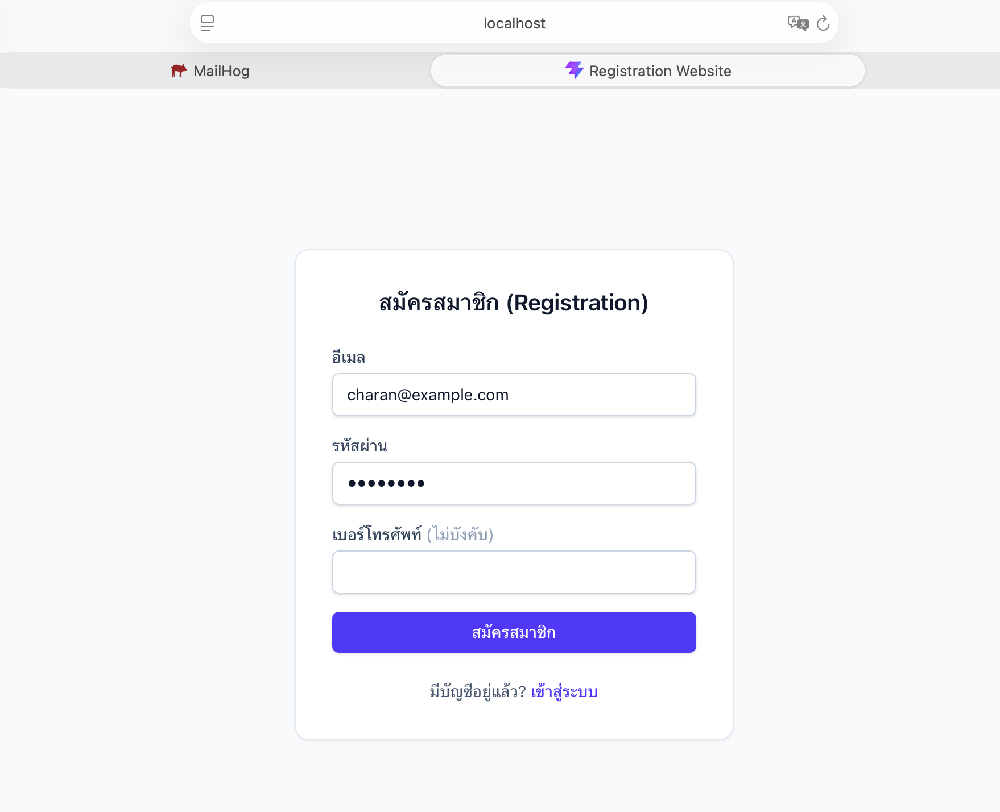
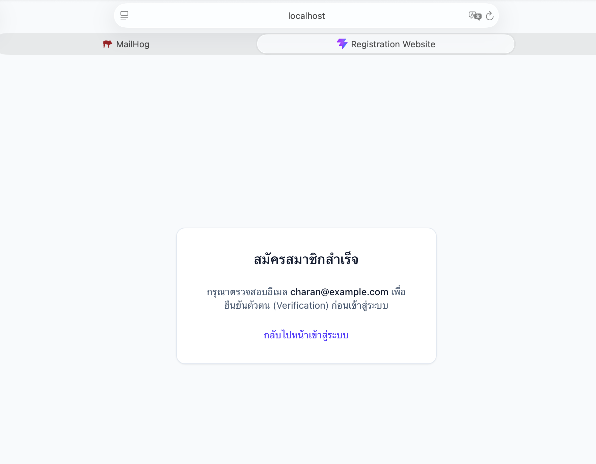
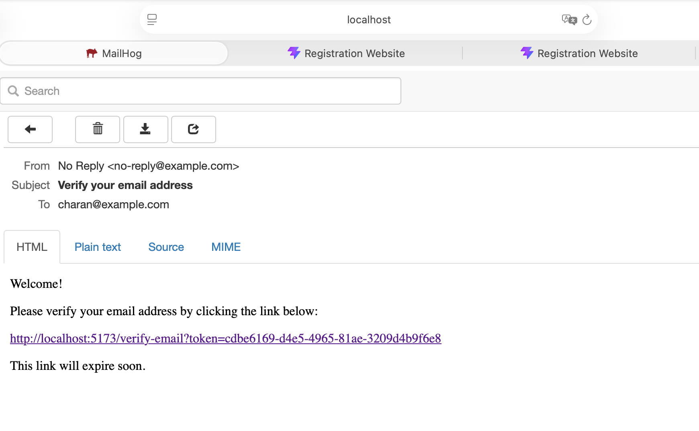
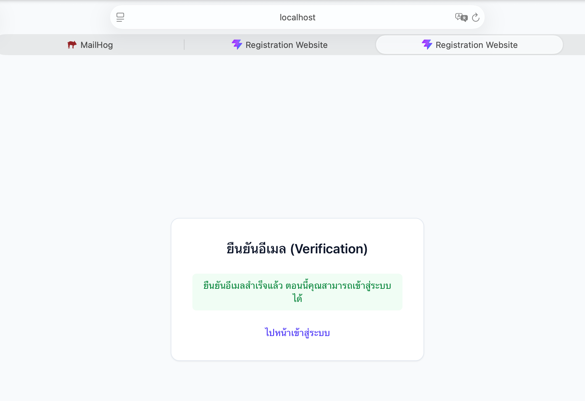
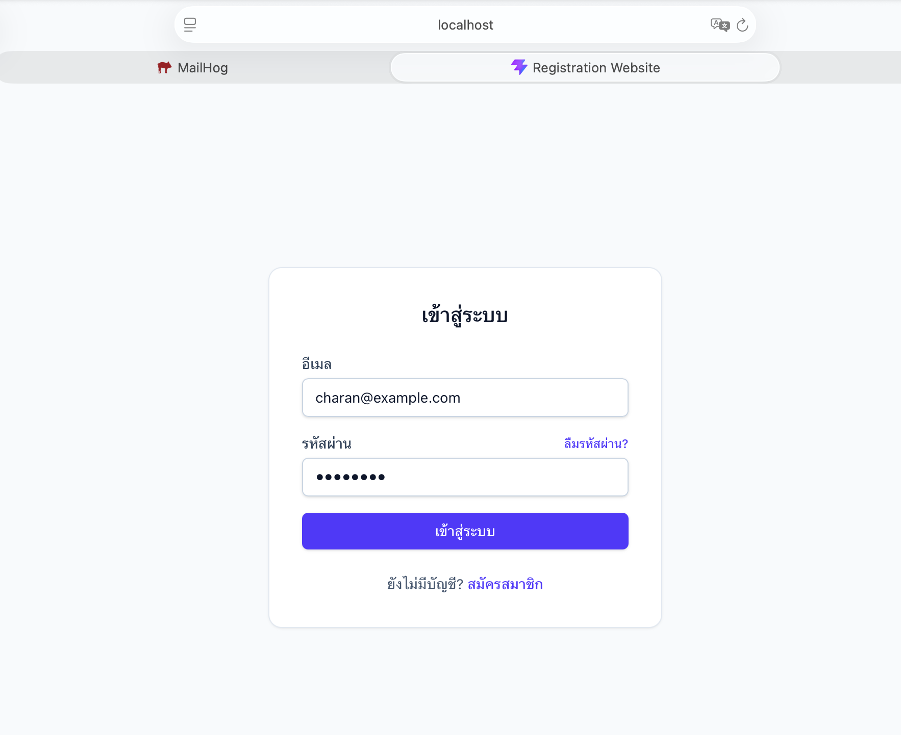
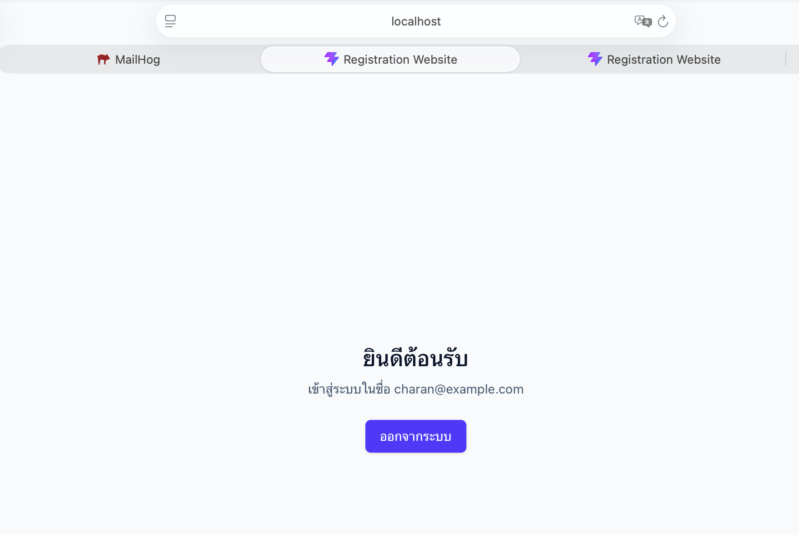

# Registration Website

เว็บไซต์สำหรับสมัครสมาชิก (**Registration**) ยืนยันอีเมล (**Verification**) เข้าสู่ระบบ (**Login**) และกู้คืน
รหัสผ่านที่ลืม (**Forgot/Reset Password**) ดูอภิธานศัพท์ของโดเมนได้ที่ [CONTEXT.md](./CONTEXT.md) และ
checklist การพัฒนาได้ที่ [Tasks.md](./Tasks.md)

Stack: React + TypeScript + Tailwind (frontend) · NestJS + Prisma + PostgreSQL (backend) · JWT Bearer token
auth ([ADR-0001](./docs/adr/0001-jwt-bearer-token-auth.md)) · Prisma ORM
([ADR-0002](./docs/adr/0002-prisma-orm.md)) · npm workspaces monorepo (`/frontend`, `/backend`) · Docker
Compose (frontend + backend + Postgres + MailHog) สำหรับ local dev

---

## Screenshots และวิธีใช้งาน

### 1. สมัครสมาชิก (Register)

กรอกอีเมล รหัสผ่าน (อย่างน้อย 8 ตัวอักษร) และเบอร์โทรศัพท์ (ไม่บังคับ) แล้วกด "สมัครสมาชิก"

| หน้าสมัครสมาชิก | สมัครสำเร็จ |
| --- | --- |
|  |  |

เมื่อสมัครสำเร็จ ระบบจะสร้างบัญชี (สถานะยังไม่ verified) และส่งอีเมลยืนยันตัวตนไปที่อีเมลที่กรอกไว้ทันที
โดยในโหมด dev อีเมลทั้งหมดจะถูกดักไว้ที่ **MailHog** (http://localhost:8025) แทนการส่งออกจริง

### 2. ยืนยันอีเมล (Verification)

เปิดอีเมลใน MailHog แล้วกดลิงก์ยืนยัน ซึ่งมีรูปแบบ `http://localhost:5173/verify-email?token=<uuid>`

| อีเมลยืนยันตัวตนใน MailHog | ยืนยันอีเมลสำเร็จ |
| --- | --- |
|  |  |

หน้า `VerifyEmail` จะอ่าน `token` จาก query string แล้วยิงไปที่ `GET /auth/verify-email?token=...` โดยอัตโนมัติ
เมื่อ token ถูกต้องและยังไม่หมดอายุ บัญชีจะถูกตั้งค่า `verified = true` และ token ที่ใช้แล้วจะถูกลบทิ้ง

### 3. เข้าสู่ระบบ (Login)

กรอกอีเมลและรหัสผ่านที่ยืนยันแล้ว ระบบจะตรวจสอบและออก JWT access token ให้

| หน้าเข้าสู่ระบบ | เข้าสู่ระบบสำเร็จ (Home) |
| --- | --- |
|  |  |

หลังเข้าสู่ระบบสำเร็จ frontend จะเก็บ JWT ไว้ใน `localStorage` และพาไปหน้า Home (route ที่มี
`ProtectedRoute` ครอบอยู่) ซึ่งจะ decode token เพื่อแสดงอีเมลของผู้ใช้ และมีปุ่ม "ออกจากระบบ" สำหรับล้าง token

### 4. ลืมรหัสผ่าน / ตั้งรหัสผ่านใหม่ (Forgot / Reset Password)

จากหน้า Login กดลิงก์ "ลืมรหัสผ่าน?" → กรอกอีเมล → ระบบส่งลิงก์ตั้งรหัสผ่านใหม่ผ่าน MailHog (รูปแบบเดียวกับ
อีเมลยืนยันตัวตน) → เปิดลิงก์ `http://localhost:5173/reset-password?token=<uuid>` → กรอกรหัสผ่านใหม่ →
ระบบตั้งรหัสผ่านใหม่ พร้อมปลดล็อกบัญชี (reset ค่า failed-login) ให้อัตโนมัติ

---

## หลักการทำงานและเทคนิคที่ใช้ (Architecture & Techniques)

### ภาพรวมสถาปัตยกรรม

```
┌────────────┐   HTTP (fetch, JSON)   ┌──────────────┐   Prisma Client   ┌────────────┐
│  Frontend  │ ─────────────────────▶ │   Backend    │ ─────────────────▶ │ PostgreSQL │
│ React+Vite │ ◀───────────────────── │ NestJS API   │ ◀───────────────── │            │
└────────────┘   Authorization:       └──────┬───────┘                    └────────────┘
                  Bearer <JWT>                │ SMTP (nodemailer)
                                               ▼
                                        ┌────────────┐
                                        │  MailHog   │  (dev mail sink)
                                        └────────────┘
```

Frontend เป็น SPA ที่ stateless ทั้งหมด (ไม่มี session/cookie ฝั่ง backend) โดย backend ออก JWT ให้หลัง
login แล้ว frontend เก็บไว้เองและแนบใน header ของทุก request ที่ต้อง auth — ทำให้ backend สามารถ scale
แบบ horizontal ได้โดยไม่ต้องมี shared session store

### Backend (NestJS + Prisma + PostgreSQL)

- **Modular architecture**: แยกเป็น `AuthModule`, `MailModule`, `PrismaModule` แต่ละโมดูล inject
  dependency กันผ่าน NestJS DI container (`backend/src/*/**.module.ts`)
- **Password hashing**: ใช้ `bcrypt` แฮชรหัสผ่านด้วย salt rounds = 10 ก่อนบันทึกลงฐานข้อมูลเสมอ ไม่มีการ
  เก็บ plaintext password (`backend/src/auth/auth.service.ts`)
- **Email verification / password reset ด้วย opaque token**: สร้าง token แบบ `crypto.randomUUID()`
  (ไม่ใช่ JWT) เก็บลงตาราง `VerificationToken` / `PasswordResetToken` พร้อม `expiresAt` ที่คำนวณจาก
  duration string เช่น `"24h"`, `"1h"` ผ่าน `parseDurationToMs()` util
  (`backend/src/common/utils/duration.util.ts`) ตรวจสอบทั้งความถูกต้องและวันหมดอายุตอน verify/reset แล้ว
  ลบ token ทิ้งทันทีหลังใช้งาน (one-time use)
- **JWT Bearer authentication**: หลัง login สำเร็จ ออก JWT (payload = `{ sub, email }`) ด้วย
  `@nestjs/jwt`; ฝั่ง protected route ใช้ `PassportStrategy` (`JwtStrategy` +
  `ExtractJwt.fromAuthHeaderAsBearerToken()`) ร่วมกับ `JwtAuthGuard` ตรวจสอบลายเซ็นและวันหมดอายุ
  (ADR-0001)
- **Account lockout algorithm (brute-force protection)**: นับ `failedLoginAttempts` ต่อ user เมื่อรหัสผ่าน
  ผิดติดต่อกันครบ `MAX_FAILED_LOGIN_ATTEMPTS = 5` ครั้ง บัญชีจะถูกล็อก
  (`lockedUntil = now + 15 นาที`) ระหว่างที่ล็อกจะปฏิเสธการ login ทันทีแม้รหัสผ่านถูกต้อง และตัวนับ/สถานะ
  ล็อกจะถูก reset เป็น 0 ทันทีที่ login สำเร็จหรือมีการ reset password
- **Rate limiting**: ใช้ `@nestjs/throttler` ตั้ง global guard (`ThrottlerGuard` เป็น `APP_GUARD`) จำกัด
  20 requests/นาที ทุก route โดยรวม และเข้มขึ้นเฉพาะจุดเสี่ยงด้วย `@Throttle()` ต่อ endpoint
  (register/forgot-password 5 ครั้ง/นาที, login 10 ครั้ง/นาที) เพื่อลดความเสี่ยง credential
  stuffing/enumeration
- **Input validation**: ใช้ global `ValidationPipe` (`whitelist`, `forbidNonWhitelisted`, `transform`)
  ร่วมกับ `class-validator` decorator บน DTO ทุกตัว (เช่น `IsEmail`, `MinLength`, `Matches`) คัด field ที่
  ไม่รู้จักทิ้งและ validate ก่อนเข้าถึง service layer เสมอ
- **Consistent error shape**: `HttpExceptionFilter` (global exception filter) แปลง exception ทุกชนิดให้อยู่
  ในรูป `{ statusCode, message, error, path, timestamp }` เดียวกัน พร้อม error code คงที่ (เช่น
  `EMAIL_NOT_VERIFIED`, `ACCOUNT_LOCKED`) ให้ frontend ใช้ branch logic ได้โดยไม่ต้อง parse ข้อความ
- **Prisma ORM**: type-safe query builder + migration tool (ADR-0002) schema กำหนด relation แบบ
  `onDelete: Cascade` ระหว่าง `User` → `VerificationToken`/`PasswordResetToken` และมี `@@index([userId])`
  เพื่อให้ lookup token ต่อ user เร็ว, migration ถูก apply อัตโนมัติ (`prisma migrate deploy`) ตอน container
  เริ่มทำงานใน Docker
- **Mail delivery**: `MailService` ใช้ `nodemailer` ส่งอีเมล HTML/plain-text ผ่าน SMTP ที่ config ได้
  (dev ชี้ไปที่ MailHog, prod เปลี่ยนแค่ ENV `SMTP_HOST/PORT/FROM`)
- **Config**: `@nestjs/config` โหลด `.env` แบบ global module อ่านค่าได้ทุกที่ผ่าน `ConfigService`

### Frontend (React + TypeScript + Tailwind)

- **Routing**: `react-router-dom` กำหนดเส้นทางทั้งหมดใน `App.tsx`; หน้า `Home` ถูกครอบด้วย
  `<ProtectedRoute>` ที่ตรวจ `isAuthenticated` จาก context แล้ว `<Navigate to="/login" />` ทันทีถ้ายังไม่ login
  (พร้อมจำ path เดิมไว้ใน `state.from`)
- **Auth state**: `AuthContext` (React Context + `useState`) เป็นแหล่งความจริงเดียวของ token/user เก็บ
  token ลง `localStorage` เพื่อให้ session คงอยู่ข้าม refresh, และ decode JWT payload แบบ base64url
  ฝั่ง client (**เพื่อแสดงผลเท่านั้น ไม่ใช่การ verify signature** — การ verify จริงเกิดที่ backend ทุก request)
  พร้อมเช็ค `exp` claim เพื่อทิ้ง token ที่หมดอายุออกจาก storage อัตโนมัติ
- **API client wrapper**: `apiRequest<T>()` (`frontend/src/api/client.ts`) เป็น thin wrapper รอบ
  `fetch` ที่แนบ `Authorization: Bearer <token>` อัตโนมัติเมื่อจำเป็น, normalize error response จาก
  Nest (`message` เป็น string หรือ string[]) ให้เป็นข้อความเดียว และโยนเป็น `ApiError` (มี `status` + `code`)
  ให้แต่ละหน้า catch ไปแสดงผลตาม error code ได้ตรงจุด (เช่นเจาะจงข้อความกรณี `ACCOUNT_LOCKED`)
- **Styling**: Tailwind CSS utility classes, responsive layout พื้นฐานสำหรับฟอร์ม auth ทุกหน้า
- **UI ภาษาไทย**: ทุกหน้า auth (Register/Login/VerifyEmail/ForgotPassword/ResetPassword/Home) แสดงผล
  เป็นภาษาไทยตาม screenshot ด้านบน

### Database (PostgreSQL + Prisma schema)

```
User
 ├─ id (uuid, PK)            email (unique)         passwordHash (bcrypt)
 ├─ phone?                   verified (bool)
 ├─ failedLoginAttempts (int, default 0)             lockedUntil (nullable timestamp)
 ├─ 1:N → VerificationToken   (onDelete: Cascade, index on userId)
 └─ 1:N → PasswordResetToken  (onDelete: Cascade, index on userId)
```

Token ทั้งสองตาราง (`VerificationToken`, `PasswordResetToken`) ใช้โครงสร้างเดียวกัน: `token` (unique
UUID), `expiresAt`, ผูกกับ `userId` — ออกแบบให้ตรวจสอบและลบทิ้งได้ในทีเดียว (verify/reset แล้วลบ token
ที่เหลือของ user นั้นทั้งหมด ป้องกัน token เก่าถูกใช้ซ้ำ)

### DevOps / Infra

- **Docker Compose** orchestrate 4 services: `postgres` (พร้อม healthcheck `pg_isready`), `mailhog`,
  `backend`, `frontend` — `backend` รอ `postgres` healthy ก่อน แล้ว `docker-entrypoint` รัน
  `prisma migrate deploy` ให้ schema ล่าสุดถูก apply ทุกครั้งที่ container start (กัน migration ตกหล่น)
- **npm workspaces monorepo**: root `package.json` มี `workspaces: ["frontend", "backend"]` ให้
  `npm install` ครั้งเดียวติดตั้งทั้งสองฝั่ง และมี script รวม (`dev:backend`, `dev:frontend`,
  `build:*`, `test:backend`) เรียกผ่าน `--workspace` flag

---

## Prerequisites

- Node.js >= 20 และ npm
- Docker + Docker Compose (สำหรับ Postgres/MailHog หรือรันทั้งระบบแบบ containerized)

## Setup

1. คัดลอกไฟล์ environment template แล้วปรับค่าตามต้องการ:

   ```bash
   cp .env.example .env
   ```

2. ติดตั้ง dependencies (npm workspaces จะติดตั้งทั้ง `frontend` และ `backend` ให้พร้อมกัน):

   ```bash
   npm install
   ```

## รันด้วย Docker Compose (แนะนำ)

รัน Postgres, MailHog, backend API และ frontend พร้อมกันทั้งหมด:

```bash
docker compose up --build
```

- Frontend: http://localhost:5173
- Backend API: http://localhost:3000
- MailHog web UI (ดูอีเมลที่ระบบส่งออก): http://localhost:8025
- Postgres: localhost:5432 (`postgres`/`postgres`, db `app`)

## รันแบบ local โดยไม่ใช้ Docker (เฉพาะ backend/frontend)

รันเฉพาะ Postgres และ MailHog:

```bash
docker compose up postgres mailhog
```

จากนั้นเปิดคนละ terminal รัน backend และ frontend จาก repo root:

```bash
npm run dev:backend
npm run dev:frontend
```

Apply Prisma migration กับฐานข้อมูล local (รันจาก `/backend` หรือผ่าน workspace flag):

```bash
npm run prisma:migrate --workspace=backend
```

## Useful scripts (จาก repo root)

| Command | Description |
| --- | --- |
| `npm run dev:backend` | รัน NestJS backend แบบ watch mode |
| `npm run dev:frontend` | รัน Vite frontend dev server |
| `npm run build:backend` | Build backend สำหรับ production |
| `npm run build:frontend` | Build frontend สำหรับ production |
| `npm run test:backend` | รัน backend unit tests |

## Project structure

```
/backend      NestJS + Prisma API (auth: register/verify-email/login/forgot-password/reset-password)
/frontend     React + TypeScript + Tailwind SPA
/docs/adr     Architecture decision records
/screen-shot  ภาพหน้าจอประกอบการใช้งาน (ใช้ในเอกสารนี้)
```
